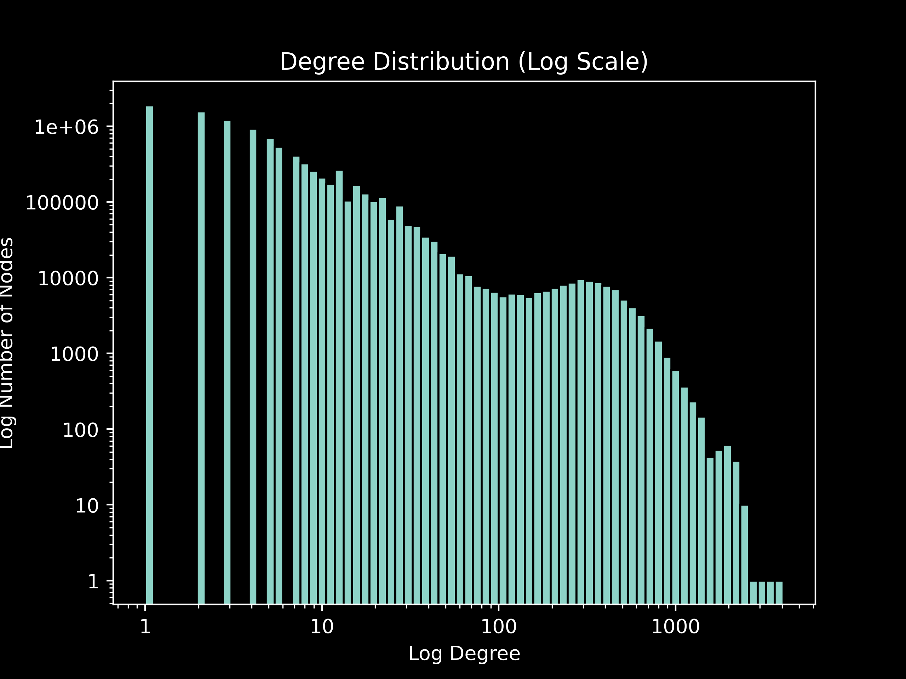
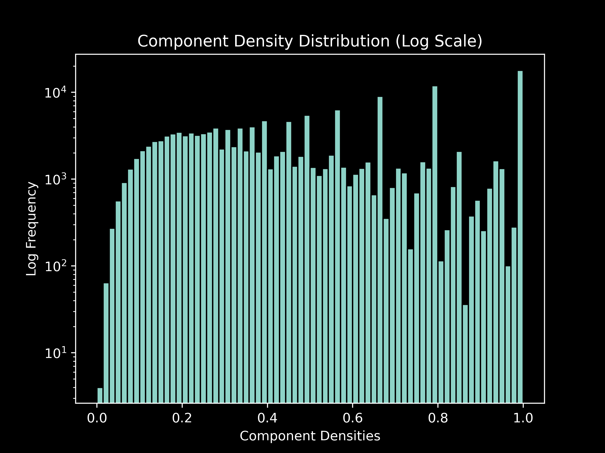
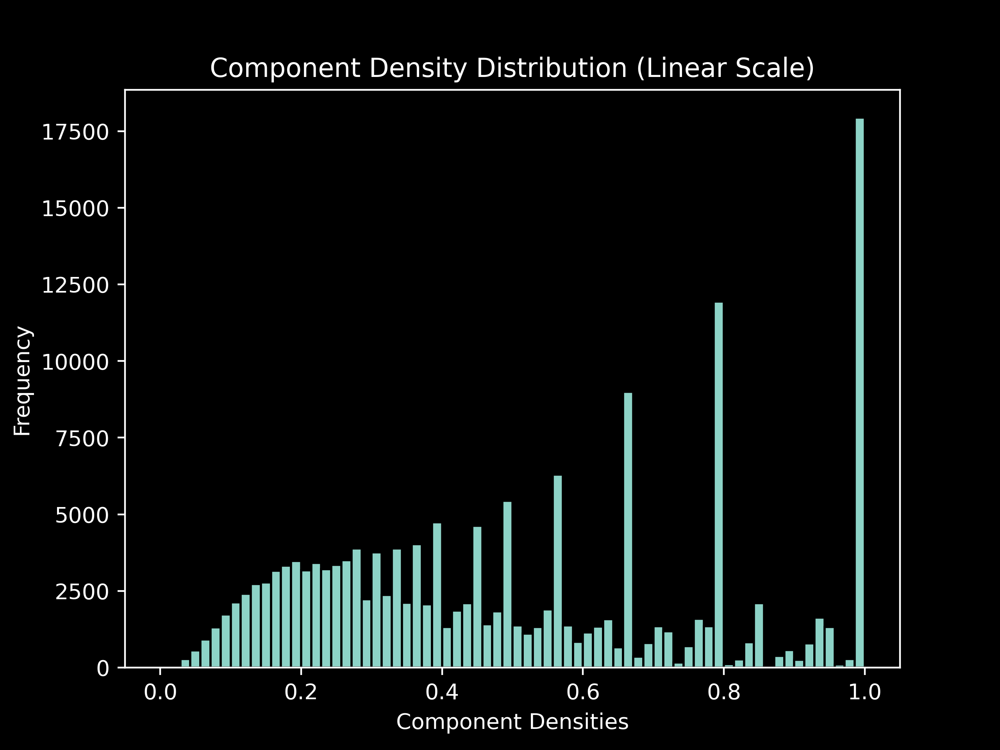

# Report: Genome Assembly Graph Project

## DA3018

#### Emil Bertlin

---

### Preprocessing the Data

The given data in the `.m4` file was preprocessed to remove unnecessary columns using `awk`. The following steps were performed:

1. The command `awk '$7 >= 1000 && $11 >= 1000 { print }' Spruce_fingerprint_2017-03-10_16.48.olp.m4 > filtered_data.m4` was executed to filter out lines with a sufficiently large overlap. The resulting lines were saved in the file `filtered_data.m4`.

2. The command `awk '{ $3=""; $4=""; $5=""; $9=""; print }' filtered_data.m4 > cleaned.m4` was executed to remove columns 3, 4, 5, and 9 from the `filtered_data.m4` file. The resulting cleaned data was saved in the file `cleaned.m4`.

See the notebook entry for 2023-05-27 ([here](./notebook/2023-05-27.md)) for more info about this (located in doc/notebook/2023-05-27.md). The solution assumes that the data is pre-cleaned so this is a necessary step.

### Graph Processing and Degree Distribution

On the date 2023-06-02 ([Notebook entry for this day](./notebook/2023-06-02.md)), a Java class named `GraphProcessor` was created to handle the graph processing part of the project. The class utilizes a HashMap to represent the graph and provides various methods for graph analysis. Below is the code for the necessary parts of `GraphProcessor` class for the degree distribution part of the project (i.e. report the degree distribution of the implicit graph which is created by our dataset):

```java
import java.io.*;
import java.util.*;

public class GraphProcessor {
    // Maps node identifiers to ints
    private Map<String, Integer> identifierToInt = new HashMap<>();
    // The graph represented as an adjacency list
    private Map<Integer, List<Integer>> graph = new HashMap<>();
    // Next available integer identifier
    private int intIdentifier = 0;

    public static void main(String[] args) {
        String filename = args[0];
        GraphProcessor gp = new GraphProcessor();
        gp.parseFile(filename);

        String baseFilename = gp.removeFileExtension(filename);
        gp.calculateDegreesToFile(baseFilename);

        /*
        ...
         */
    }

    // Parses the file and builds the graph
    public void parseFile(String filename) {
        // Open file and read each line
        try (BufferedReader br = new BufferedReader(new FileReader(filename))) {
            String line;
            while ((line = br.readLine()) != null) {
                String[] vertices = line.split("\\s+");
                int v1 = getOrCreateIntIdentifier(vertices[0]);
                int v2 = getOrCreateIntIdentifier(vertices[1]);

                // Add vertices to the graph
                graph.computeIfAbsent(v1, k -> new ArrayList<>()).add(v2);
                graph.computeIfAbsent(v2, k -> new ArrayList<>()).add(v1);
            }
        } catch (IOException e) {
            e.printStackTrace();
        }
    }

    // Removes file extension from a filename if present
    private String removeFileExtension(String filename) {
        int lastDotIndex = filename.lastIndexOf(".");
        return (lastDotIndex > 0) ? filename.substring(0, lastDotIndex) : filename;
    }

    /**
     * Gets the integer identifier for a node. If the node does not yet have an identifier,
     * it assigns and returns a new one.
     *
     * @param identifier The node's identifier.
     * @return The node's integer identifier.
     */
    public int getOrCreateIntIdentifier(String identifier) {
        return identifierToInt.computeIfAbsent(identifier, k -> intIdentifier++);
    }

    /**
     * Writes the degree of each vertex to a file. The file's name is the base filename
     * followed by "_degrees.txt".
     *
     * @param filename The base filename to write to.
     */
    public void calculateDegreesToFile(String filename) {
        try (PrintWriter pw = new PrintWriter(new FileWriter(filename + "_degrees.txt"))) {
            for (int v : graph.keySet()) { // Iterate over each vertex in the graph.
                pw.println(graph.get(v).size()); // Write degree of node to file.
            }
        } catch (IOException e) {
            e.printStackTrace();
        }
    }
    /*
    ... <the rest of the code> ...
    */
```

The attribute `identifierToInt` is a HashMap mapping node identifiers (contig strings) to integers and the `graph` attribute is a HashMap representing the graph as an adjacency list. This representation allows for efficient storage and retrieval of graph information (it uses integers as keys instead of the long contig string).

The `parseFile` method reads the input file line by line and creates vertices and edges to the graph. This process has time complexity $O(n)$, where $n$ is the number of lines in the file. The space complexity is $O(n)$.

We calculate the degree distribution via the method `calculateDegreesToFile` and store it in a new TXT file. The method iterates over each vertex in the graph and retrives the size of the adjacency list, which is the degree of the given vertex. The time complexity of this operation is $O(n)$, where $n$ is the number of nodes in the graph. The space complexity is $O(1)$ because it doesn't use any additional data structures that grow with the input file size (it only createsa PrintWriter and FileWriter, which do not depend on input size).

The method `getOrCreateIntIdentifier` assigns an integer identifier to each vertex in the graph. It uses a HashMap `identifierToInt` to store the mappings between node identifiers and integers. This ensures uniqueness. The average case time complexity of this is $\theta(1)$ (I think it's $O(n)$ in the worst case if there is a collision).

The degree distribution which is written to a TXT file is then visualized by a histogram via Python and matplotlib (and numpy), which is implemented in the script `plot_degree_histogram.py` (see notebook entry for day 2023-06-02 for more information).

Note: I didn't write any formal tests for this I just tested it manually on small datasets.

This is the histograms in log scale for the degree distribution of the graph by the entire dataset (cleaned):



---

### Number of components in graph with at least three vertices

In this part we determine the number of components in the graph that have at least three vertices. The implementation uses a depth-first search (DFS) algorithm to traverse the graph and count the components. The relevant code is shown below:

```java
    /**
     * Counts the number of connected components in the graph that have at least three vertices.
     * Uses depth-first search (DFS) to traverse the graph.
     *
     * @return The count of components with at least three vertices.
     *
     * Time Complexity: O(V + E) where V is the number of nodes and E is the number of edges in the graph.
     */
    public int countComponents() {
        Set<Integer> visited = new HashSet<>(); // We use a HashSet instead of array better for time complexity (contains operation)
        int componentCount = 0;

        for (int node : graph.keySet()) {
            if (!visited.contains(node)) {
                // if vertex count >= 3 add 1 to componentCount else add 0 (ternary)
                componentCount += (dfsCountNodes(node, visited) >= 3) ? 1 : 0;
            }
        }

        return componentCount;
    }

    // DFS helper for counting nodes, returns vertex count
    private int dfsCountNodes(int node, Set<Integer> visited) {
        visited.add(node);
        int verticesCount = 1;

        for (int neighbor : graph.get(node)) {
            verticesCount += (!visited.contains(neighbor)) ? dfsCountNodes(neighbor, visited) : 0;
        }

        return verticesCount;
    }
```

The DFS algorithm is chosen for its simplicity and effectiveness in identifying connected regions within a graph.

The `countComponents` method uses DFS to traverse the graph and count the components. It maintains a set of visited nodes and incrementally counts the number of vertices in each connected component.

The time complexity of the algorithm is $O(V + E)$, where $V$ is the number of nodes and $E$ is the number of edges in the graph. The space complexity is $O(V)$.

The DFS algorithm is well-suited for our dataset, providing an efficient solution to count components with at least three vertices. We didn't encounter any significant limitations or challenges when applying this algorithm to our project.

The number of connected components with at least three vertices in the graph formed by the cleaned dataset (which is supposed to be just the data we care about) is 226,769.

```bash
❯ javac GraphProcessor.java; jar cfm GraphProcessor.jar MANIFEST.MF GraphProcessor.class; java -Xss1G -Xms24G -jar GraphProcessor.jar ../overlaps.m4/cleaned.m4
Number of components with at least three vertices: 226796
```

See notebook entry for the date 2023-06-03 for more info [here](./notebook/2023-06-03.md).

---

### Component Density Distribution

The density of a component is the number of edges in the component divided by the number of all possible edges for a component with the same number of vertices. That is, for a component $C=(V, E)$ the numerator is $|E|$ and the denominator is the number of edges in the complete graph with $|V|$ vertices $K_{|V|}$ (because a complete graph has the maximum number of edges for any simple undirected graph) and this is equal to $|V|(|V|-1)/2$. So graph density is given by $\frac{|E|}{|V|(|V|-1)/2}=\frac{2|E|}{|V|(|V|-1)}$ (for simple undirected graphs, and thus also components because components). See [Dense Graph Wikipedia Page](https://en.wikipedia.org/wiki/Dense_graph) and [notebook entry for 2023-06-03](./notebook/2023-06-03.md). This is what we are trying to find for each component (of size $\geq$ 3) in our graph. This is the relevant Java code for this:

```java
    /**
     * Calculates the density of each component in the graph with at least three vertices and writes them to a file.
     * The file's name is the base filename followed by "_component_densities.txt".
     * Only components with densities between 0 and 1 (inclusive) are considered.
     *
     * @param filename The base filename to write to.
     */
    public void calculateComponentDensityToFile(String filename) {
        List<Double> densities = new ArrayList<>();

        Set<Integer> visited = new HashSet<>();

        // Iterate over each node in the graph
        for (int node : graph.keySet()) {
            // Check if the node has not been visited
            if (!visited.contains(node)) {
                Set<Integer> component = new HashSet<>();

                // Perform depth-first search to populate the component set
                dfsDensity(node, visited, component);

                if (component.size() >= 3) {
                    double density = calculateDensity(component);
                    densities.add(density);
                }
            }
        }

        // Write the densities to a file
        try (PrintWriter pw = new PrintWriter(new FileWriter(filename + "_component_densities.txt"))) {
            for (double density : densities) {
                // Check if the density is within the valid range (between 0 and 1 inclusive)
                // The graph is messy so I got an error where the were components that had density
                // greater than 1 which is impossible
                if (density >= 0 && density <= 1) {
                    // Write the density to the file
                    pw.println(density);
                }
            }
        } catch (IOException e) {
            e.printStackTrace();
        }
    }

    /**
     * Calculates the density of a given component.
     * For an undirected simple component C=(V,E) density is defined as (2|E|)/(|V|(|V|-1)).
     *
     * @param component The nodes of the component to calculate the density of.
     * @return The density of the component.
     */
    private double calculateDensity(Set<Integer> component) {
        int edgesCount = 0;

        // Iterate over each node in the component
        for (int node : component) {
            // Get the neighbors of the current node
            List<Integer> neighbors = graph.get(node);

            // Count the number of neighbors within the component
            for (int neighbor : neighbors) {
                if (component.contains(neighbor)) {
                    edgesCount++;
                }
            }
        }

        double nodesCount = component.size();
        double possibleEdges = (nodesCount * (nodesCount - 1)) / 2.0;
        return (double) edgesCount / possibleEdges; // cast to double to ensure floating-point division
    }

    /**
     * DFS helper for calculating the component's density. Populates the given 'component' set
     * with the nodes of the component to which 'node' belongs.
     *
     * @param node The node to start the DFS from.
     * @param visited The set of nodes that have already been visited.
     * @param component The set of nodes in the component.
     */
    private void dfsDensity(int node, Set<Integer> visited, Set<Integer> component) {
        visited.add(node);
        component.add(node);

        for (int neighbor : graph.get(node)) {
            if (!visited.contains(neighbor)) {
                dfsDensity(neighbor, visited, component);
            }
        }
    }
```

A depth-first search (DFS) algorithm was used here as well. It is used to identify connected components. Starting from each unvisited node, the DFS explores all reachable vertices to populate the component set. We then calculate the density with the density forumal for each component with at least three vertices.

- Time Complexity: The time complexity of the `calculateComponentDensityToFile` method is $O(|V| + |E|)$, where $|V|$ is the number of nodes and $|E|$ is the number of edges in the graph. This is because the method performs a depth-first search on the graph, visiting each node once and its neighbors once. The `calculateDensity` method has a nested loop that iterates through each node and its neighbors, resulting in a time complexity of $O(N^2)$, where $N$ is the number of nodes in the component.

- Space Complexity: The `calculateComponentDensityToFile` method uses a HashSet to keep track of visited nodes, which requires $O(|V|)$ space. The `calculateDensity` method uses additional space to store the component nodes and their neighbors, resulting in a space complexity of $O(N)$, where $N$ is the number of nodes in the component.

The Python script to plot the histogram of the density distribution is called `plot_component_density_histogram.py` in the src folder.

Here are the histograms for the cleaned data:





## Usage

Make sure that the data is in a folder in the directory. My dataset folder is called `overlap.m4`. This is my directory setup:

```bash
❯ tree .
.
├── doc
│   ├── notebook
│   │   ├── 2023-05-15.md
│   │   ├── 2023-05-23.md
│   │   ├── 2023-05-27.md
│   │   ├── 2023-06-02.md
│   │   └── 2023-06-03.md
│   └── report.md
├── images
│   ├── cleaned_component_densities_linear.png
│   ├── cleaned_component_densities_log.png
│   ├── cleaned_degrees_linear.png
│   └── cleaned_degrees_log.png
├── out
│   └── production
│       └── project_genome_assembly_graph
│           ├── DegreeDistribution.class
│           ├── degree_distribution.py
│           ├── GraphPreprocessor.class
│           ├── graph_processing.py
│           └── GraphProcessor.class
├── overlaps.m4
│   ├── cleaned.m4
│   ├── Spruce_fingerprint_2017-03-10_16.48.olp.m4
│   ├── test_data0.m4
│   └── test_data1.m4
├── project_genome_assembly_graph.iml
├── README.md
└── src
    ├── GraphProcessor.class
    ├── GraphProcessor.jar
    ├── GraphProcessor.java
    ├── MANIFEST.MF
    ├── plot_component_density_histogram.py
    └── plot_degree_histogram.py

9 directories, 27 files
```

You have to start by cleaning the data file `Spruce_fingerprint_2017-03-10_16.48.olp.m4`, do this via the following command (cd into overlaps.m4 directory first):

```bash
❯ awk '$7 >= 1000 && $11 >= 1000 { $3=""; $4=""; $5=""; $9=""; print }' Spruce_fingerprint_2017-03-10_16.48.olp.m4 > cleaned.m4
```

Next we can create the necessary TXT files:

```bash
❯ z ../src; java -Xss1G -Xms24G -jar GraphProcessor.jar ../overlaps.m4/cleaned.m4
Number of components with at least three vertices: 226796
```

(Change flags -Xss and -Xms as needed depending on how much RAM you want to use, I have 32GB of RAM for reference.) This will create two files in the `overlaps.m4` directory: `cleaned_component_densities.txt` and `cleaned_degrees.txt`

```bash
project_genome_assembly_graph/src on  main [!] via ☕ v20.0.1 via 🐍 v3.11.3
❯ ls ../overlaps.m4/*.txt
Permissions Size User Date Modified Name
.rw-r--r--  2,6M emil  4 jun 16:28  ../overlaps.m4/cleaned_component_densities.txt
.rw-r--r--   21M emil  4 jun 16:28  ../overlaps.m4/cleaned_degrees.txt
```

To create histograms run the following:

```bash
❯ python plot_degree_histogram.py ../overlaps.m4/cleaned_degrees.txt; python plot_component_density_histogram.py ../overlaps.m4/cleaned_component_densities.txt
```

Now you should have four new PNG images in the `overlaps.m4` directory:

```bash
❯ cd ../overlaps.m4/; ls *.png
Permissions Size User Date Modified Name
.rw-r--r--  116k emil  4 jun 16:36  cleaned_component_densities_linear.png
.rw-r--r--   95k emil  4 jun 16:36  cleaned_component_densities_log.png
.rw-r--r--  107k emil  4 jun 16:36  cleaned_degrees_linear.png
.rw-r--r--  104k emil  4 jun 16:36  cleaned_degrees_log.png
```

That's it, now you can view these.

Note: the `cleaned_degrees_linear.png` image is not very informative. Also note that my `ls` command is aliased as `ls -al` that's why is looks like that.
